  

 

Full-Stack Developer with a security-first mindset. Building software since 2018 — from early algorithmic problem-solving to architecting modern, data-intensive web applications. Long-term vision: a technology startup at the intersection of scalable software and secure infrastructure.

##  Experience

**Mercedes-Benz — IT Intern**
Hands-on enterprise experience in corporate IT infrastructure, system operations, and security processes.

**Voltaria Robotics (FRC) — Software Co-Captain**
Led the software team, drove technical decision-making, and bridged the gap between mechanical engineering and algorithmic logic.

**Independent Ventures — SaaS & E-Commerce**
Architected nationwide depot management systems and high-traffic B2C/B2B supply chains (**Parça Hizmetleri**) alongside modern event-tech solutions (**Albumfest**).

##  Tech Stack

  
  
  
  
  
  
  
  
  
  

 

**Core focus:** SaaS Architecture · Secure-by-Design Systems · Analytical Problem Solving · Large-Scale Data Management

##  Analytics

  

  

  <picture>
    <source media="(prefers-color-scheme: dark)" srcset="https://raw.githubusercontent.com/Er4yB0ran/Er4yB0ran/output/github-contribution-grid-snake-dark.svg">
    <source media="(prefers-color-scheme: light)" srcset="https://raw.githubusercontent.com/Er4yB0ran/Er4yB0ran/output/github-contribution-grid-snake.svg">
    
  </picture>

##  Connect

  
  
  

